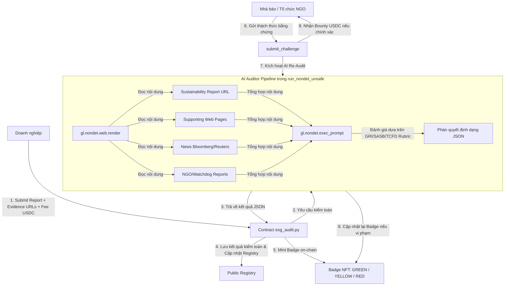
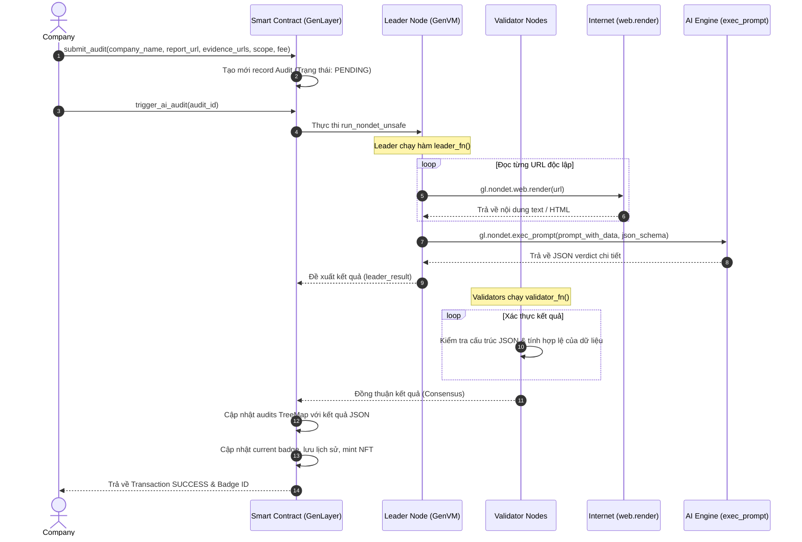

# 🏛️ Kiến trúc hệ thống ESGAudit

Tài liệu này mô tả chi tiết kiến trúc kỹ thuật, luồng nghiệp vụ dữ liệu, và cách thức hoạt động của nền tảng **ESGAudit** trên blockchain GenLayer.

---

## 🗺️ Sơ đồ luồng nghiệp vụ tổng quan

Dưới đây là sơ đồ luồng đi từ lúc doanh nghiệp gửi hồ sơ kiểm toán cho đến khi phát hành Badge on-chain và cơ chế giám sát từ cộng đồng:

---

## 📊 Bảng so sánh giải pháp

| Tính chất / Tính năng | Kiểm toán Big4 truyền thống | Tổ chức chấm điểm ESG (MSCI/Sustainalytics) | **ESGAudit (GenLayer)** |
| :--- | :--- | :--- | :--- |
| **Chi phí** | Rất đắt ($50,000 - $500,000) | Đắt ($30,000 - $100,000/năm) | **Rất rẻ ($500 - $2,000 per audit)** |
| **Tốc độ thực hiện** | 3 - 6 tháng | Cập nhật theo quý | **30 phút** |
| **Tính minh bạch** | Quy trình đóng kín, báo cáo giấy | Đóng hộp đen (Black-box scoring) | **Công khai toàn bộ lập luận & bằng chứng on-chain** |
| **Cơ chế Thổi còi** | Không có | Rất hạn chế, cập nhật trễ | **Tích hợp sẵn phần thưởng kinh tế (USDC Bounty)** |
| **Giám sát thời gian thực**| Không (kiểm toán định kỳ năm) | Cập nhật theo quý | **Giám sát liên tục mỗi quý (Premium Tier)** |
| **Khả năng tiếp cận** | Chỉ dành cho doanh nghiệp lớn | ~10K công ty lớn toàn cầu | **Không giới hạn (mọi quy mô doanh nghiệp)** |
| **Tính xác thực** | Tin tưởng vào uy tín hãng kiểm toán | Tin tưởng vào đại lý xếp hạng | **Đồng thuận mật mã học + Trí tuệ nhân tạo** |

---

## 🔄 Biểu đồ tuần tự (Sequence Diagram) của `trigger_ai_audit`

Quy trình kích hoạt AI đánh giá báo cáo bền vững bất định (nondeterministic execution) thông qua mạng lưới đồng thuận GenLayer:

---

## ⚠️ Quản lý các trường hợp ngoại lệ (Edge Cases)

Trong quá trình thực thi trên blockchain GenLayer, hệ thống cần xử lý các biên dữ liệu phức tạp sau:

### 1. Xử lý Báo cáo dạng PDF dài (50 - 200 trang)
* **Thách thức**: Hàm `web.render` đọc báo cáo PDF có thể tạo ra dữ liệu văn bản quá lớn, vượt quá giới hạn token đầu vào (context window) của LLM hoặc làm tăng chi phí gas đáng kể.
* **Giải pháp**:
  - Khuyến nghị doanh nghiệp cung cấp trang phát triển bền vững dạng HTML (Sustainability Web Page) thay vì file PDF trực tiếp.
  - Trong code hợp đồng thông minh, nếu phát hiện URL là PDF hoặc quá dài, hệ thống sẽ thực hiện phân tách sơ bộ các phần chính (materiality, emissions, target) hoặc dùng `web.render` ở chế độ trích xuất nội dung văn bản tinh gọn để giảm dung lượng tải.

### 2. Báo cáo đa ngôn ngữ (Multilingual Reports)
* **Thách thức**: Một số doanh nghiệp xuất bản báo cáo bằng tiếng bản địa (Tiếng Nhật, Đức, Việt Nam...) thay vì Tiếng Anh.
* **Giải pháp**: 
  - LLM trong GenLayer hỗ trợ đa ngôn ngữ rất tốt. Prompt được thiết kế để yêu cầu AI tự động dịch/hiểu tài liệu nguồn và trả về kết quả cấu trúc JSON thống nhất bằng Tiếng Anh để đồng bộ hiển thị trên Public Registry toàn cầu.

### 3. Các nguồn tin tức có tường phí (Paywalled News Sources)
* **Thách thức**: Các báo lớn như Financial Times, Bloomberg, Wall Street Journal có tường phí khiến `web.render` chỉ đọc được trang đăng nhập/giới hạn.
* **Giải pháp**:
  - Hợp đồng hỗ trợ doanh nghiệp submit danh sách tối đa 10 đường dẫn làm bằng chứng. Nếu một URL tin tức bị chặn (trả về lỗi hoặc nội dung quá ngắn), code Python trong `esg_audit.py` sẽ bỏ qua nguồn này và tiếp tục xử lý các nguồn khác một cách độc lập (`try-except` bên trong vòng lặp đọc dữ liệu).
  - Tỷ lệ tin cậy của cuộc kiểm toán (`confidence_score`) sẽ được điều chỉnh giảm đi một chút nếu có quá ít nguồn bằng chứng được đọc thành công.
